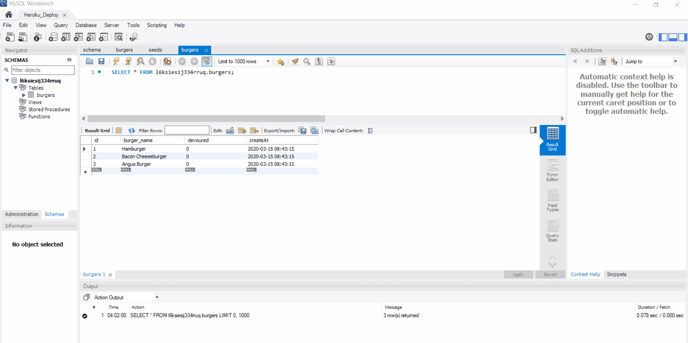

# Eat-Da-Burger

 Deployed website: https://eat-da-burger-hw-03152020.herokuapp.com/ 

### Description

* This is a burger logger application combining with MySQL, Node, Express, Express-Handlebars and a customized ORM.
* It lets users input the names of burgers they'd like to eat.
* There are two list: waiting list and devoured list.
* Whenever a user submits a burger's name, your app will display the burger on the waiting list -- waiting to be devoured.
* Each burger in the waiting area also has a `Devour` button. When the user clicks it, the burger will move to the devoured list.
* The app will also store every burger in a database, whether devoured or not.
* The app server was deployed on Heroku with JawsDB MySQL Add-on for the database.

### Demo

